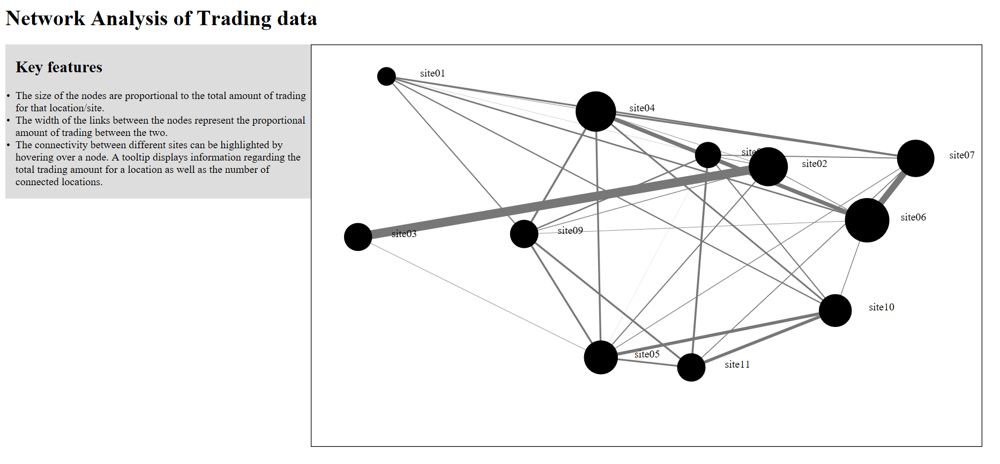
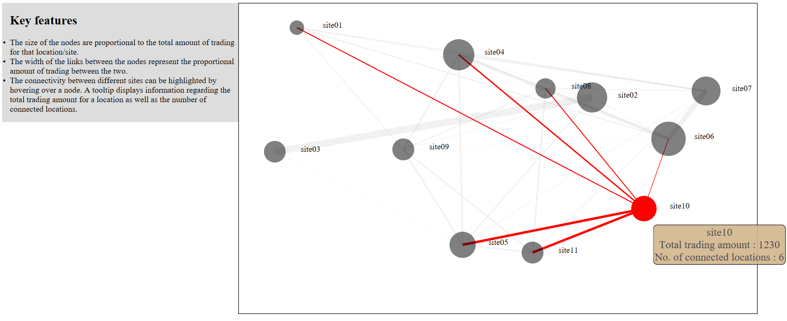

# D3-network-analysis
Network analysis of trading data using d3.js

In this project, an interactive visualisation is created using D3. The visualisation will present network data and provide tooltips when the user hovers above the visual elements.

It is trading data between different locations. And it contains:

* Screen position in pixels of different locations.
* Trade amounts between different locations. This network is un-directed.

Task performed: 
* Read in the data using D3.
* Draw the locations as circles, and make the radius of circles proportional to the total trading amount.
* Draw the trading as lines between the locations, and make the thickness of lines proportional to the amount.
* Hovering on a circle, highlight the circle and all lines connected to it (by making other circles and lines transparent).
* Hovering on a circle, show a tooltip with its information about the total amount of trading and the number of connected locations.

## Preview of the app:

* Landing pafe of the app

* On hover

